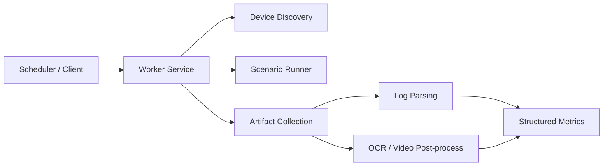

# AutoScript Public

[](https://github.com/Nightaw/autoscript-public/actions/workflows/ci.yml)

公开版移动端音视频自动化测试框架 demo，聚焦于质量指标提取、结构化结果输出和 worker 形态的工程组织。

## Overview

This repository presents a sanitized, runnable slice of a mobile media quality automation system. It focuses on the parts that are most suitable for public demonstration:

- 播放器输出状态卡顿识别
- 多信号超时事件聚类
- 分辨率变化时间线提取
- mock worker 服务与结构化报告输出

## Problem Scope

移动端音视频质量测试真正困难的地方，不是“写一个自动化脚本点点点”，而是把下面这些能力串成一条能复用的链路：

- 真机执行场景
- 录屏与日志采集
- 卡顿与分辨率等指标提取
- 结果结构化输出
- 新业务的快速接入

这个公开版仓库重点展示其中的“结果提取”和“工程化组织”。

## Architecture



## Key Capabilities

### Output-State Stall Extraction

Recovers stall intervals by pairing `stopOutput()` and `startOutput()` events from sanitized player logs.

### Timeout Cluster Detection

Groups weak signals such as video timeouts, audio timeouts, display idle events, and render timeouts into higher-confidence stall windows.

### Resolution Timeline Extraction

Builds a normalized resolution timeline from decoder log width/height changes.

### Mock Worker Reporting

Runs a demo scenario and aggregates multiple metrics into a single structured report that can be returned by an API.

## Demos

### 1. Output-State Stall Demo

通过 `stopOutput()` / `startOutput()` 配对恢复卡顿区间。

运行：

```bash
python3 tools/parse_demo_log.py samples/logs/demo_player.log
```

结果样例见 [output_stalls.json](./samples/results/output_stalls.json)。

### 2. Timeout Cluster Demo

把视频超时、音频超时、显示 idle、渲染超时等弱信号按时间邻近性聚类，得到“疑似卡顿窗口”。

运行：

```bash
python3 tools/parse_timeout_log.py samples/logs/demo_timeout.log
```

结果样例见 [timeout_clusters.json](./samples/results/timeout_clusters.json)。

### 3. Resolution Timeline Demo

解析解码器日志中的 `raw.size.width/height` 变化，输出规范化分辨率时间线。

运行：

```bash
python3 tools/parse_resolution_log.py samples/logs/demo_resolution.log
```

结果样例见 [resolution_timeline.json](./samples/results/resolution_timeline.json)。

### 4. Run All Demos

```bash
python3 tools/run_demo_suite.py
```

### 5. Mock Worker API Demo

启动本地 worker：

```bash
python3 tools/run_worker_server.py
```

然后触发一次 mock job：

```bash
curl -X POST http://127.0.0.1:7777/demo/run \
  -H "Content-Type: application/json" \
  -d @samples/payloads/baseline_playback.json
```

返回结果样例见 [baseline_playback_report.json](./samples/results/baseline_playback_report.json)。

## Repository Layout

```text
autoscript-public/
├── common/
│   ├── stall_detector.py        # 卡顿识别与聚类
│   ├── resolution_detector.py   # 分辨率时间线提取
│   └── demo_job_runner.py       # mock 场景编排与报告汇总
├── app/
│   ├── __init__.py              # Flask app factory
│   └── server.py                # worker demo API
├── tools/
│   ├── parse_demo_log.py        # 输出状态卡顿解析 CLI
│   ├── parse_timeout_log.py     # 超时聚类解析 CLI
│   ├── parse_resolution_log.py  # 分辨率解析 CLI
│   ├── run_demo_suite.py        # 一次跑完全部样例
│   ├── run_mock_job.py          # 输出结构化 demo report
│   └── run_worker_server.py     # 启动 worker demo 服务
├── samples/
│   ├── logs/                    # 脱敏日志输入
│   ├── payloads/                # mock 请求体
│   └── results/                 # 预期结果输出
├── tests/                       # 单元测试 / API 测试
└── docs/                        # 架构、设计取舍、面试摘要
```

## Quick Start

```bash
python3 -m venv .venv
source .venv/bin/activate
pip install -r requirements.txt
python3 tools/run_demo_suite.py
python3 tools/run_mock_job.py
```

## Tests

```bash
python3 -m unittest discover -s tests -v
```

## Repository Notes

This repository is intentionally scoped to sanitized demo components, sample inputs, and reproducible outputs. Internal environments, business-bound scripts, private endpoints, credentials, and binary assets are excluded from the public version.

## Documentation

- [项目架构](./docs/architecture.md)
- [设计取舍](./docs/design-decisions.md)
- [Worker API Demo](./docs/worker-api.md)
- [项目摘要](./docs/interview-notes.md)
- [公开范围说明](./docs/public-scope.md)

## Notes

- 这不是原始工作仓库。
- 仓库中的示例代码和样例数据均为公开展示用途。
- 如果继续扩展这个仓库，应坚持“脱敏重构优先”而不是“直接搬运原项目文件”。
