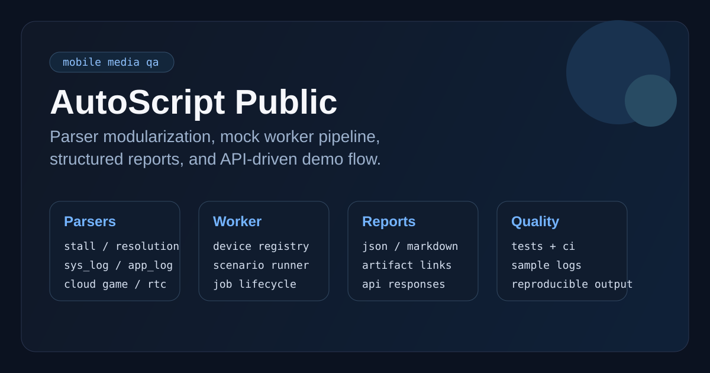
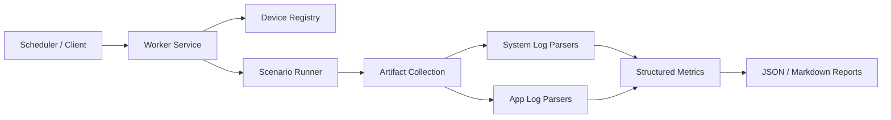

# AutoScript Public

[](https://github.com/Nightaw/autoscript-public/actions/workflows/ci.yml)



这是我从本地移动端音视频自动化测试项目里整理出来的一份公开版 demo。  
我没有去做“把原项目原样搬上来”这件事，而是把我觉得最有代表性的几层能力重新抽出来，做成一个可以直接运行、也方便别人快速看懂的版本。

现在这份公开版主要保留了三类东西：

- 日志指标提取：卡顿、超时聚类、分辨率变化
- worker 形态：设备清单、场景执行、结构化结果输出
- parser 模块化：按 `stall / resolution`、按 `sys_log / app_log` 拆分入口

## 我想解决的问题

做移动端音视频质量测试时，真正麻烦的往往不是“把 App 点起来”，而是怎么把下面这条链路做稳定：

- 任务进入执行节点
- 真机完成场景动作
- 录屏和日志被采集下来
- 卡顿、分辨率等指标被稳定提取
- 最后输出成结构化结果，方便回归和比对

所以这个仓库重点展示的不是某个单独脚本，而是这套链路里最有工程味的部分。

## 这次公开版里有什么

### 1. Output-State Stall

最基础的一条卡顿识别路径。  
根据播放器日志里的 `stopOutput()` / `startOutput()` 事件配对出卡顿区间。

### 2. Timeout Cluster

比单一状态更进一步。  
把视频超时、音频超时、显示 idle、渲染超时这类弱信号按时间邻近性聚类，得到更接近真实异常窗口的结果。

### 3. Resolution Timeline

从系统日志里提取解码宽高变化，输出规范化分辨率时间线。

### 4. App Log Resolution Parser

除了系统日志，这里还补了 app log 侧的 RTC `render_stats` 解析。  
这部分主要是为了体现最近这波重构里 parser 的模块化方向。

### 5. Mock Worker Pipeline

公开版里有一套简化过的 worker 流程：

- mock device registry
- mock scenario runner
- JSON report
- Markdown report
- Flask API

这样仓库看起来更像一个小型框架，而不是一堆离散的解析脚本。

### 6. Job Lifecycle

这次又往前补了一层轻量任务生命周期：

- enqueue job
- list jobs
- process next job
- query job detail

这样首页展示的不再只是“直接跑一个脚本”，而是一个更接近真实 worker 的处理过程。

## 架构图



## 目录结构

```text
autoscript-public/
├── app/                       # mock worker API
├── common/                    # 模型、registry、runner、formatter
├── parsers/
│   ├── stall/                 # stall parser 入口
│   └── resolution/            # resolution parser 入口
├── tools/                     # CLI 工具
├── samples/
│   ├── logs/                  # 脱敏日志样例
│   ├── payloads/              # mock 请求体
│   └── results/               # JSON / Markdown 输出样例
├── tests/                     # 单元测试 / API 测试
└── docs/                      # 架构说明与补充文档
```

## 快速体验

```bash
python3 -m venv .venv
source .venv/bin/activate
pip install -r requirements.txt
```

### 跑全部 demo

```bash
python3 tools/run_demo_suite.py
```

### 跑 mock job

```bash
python3 tools/run_mock_job.py
```

### 导出 Markdown 报告

```bash
python3 tools/export_report_markdown.py
```

### 解析 RTC app log

```bash
python3 tools/parse_app_log_resolution.py samples/logs/demo_rtc_app.log
```

### 启动 worker API

```bash
python3 tools/run_worker_server.py
curl -X POST http://127.0.0.1:7777/demo/run \
  -H "Content-Type: application/json" \
  -d @samples/payloads/baseline_playback.json
```

### 体验 job lifecycle

```bash
python3 tools/demo_job_lifecycle.py
```

## 样例输出

- [baseline_playback_report.json](./samples/results/baseline_playback_report.json)
- [baseline_playback_report.md](./samples/results/baseline_playback_report.md)
- [output_stalls.json](./samples/results/output_stalls.json)
- [timeout_clusters.json](./samples/results/timeout_clusters.json)
- [resolution_timeline.json](./samples/results/resolution_timeline.json)
- [app_log_resolution_timeline.json](./samples/results/app_log_resolution_timeline.json)

## 我觉得这个项目最值钱的地方

不是“自动化点点点”，而是下面这些更偏工程化的事情：

- 把解析逻辑从业务脚本里拆出来，形成独立 parser 层
- 把设备、场景、执行步骤、报告结构做成明确模型
- 同时支持 JSON 报告和 Markdown 报告，方便接接口和接文档
- 用 API + tests + CI 把 demo 仓库也做成一个可维护的小项目

## 文档

- [项目架构](./docs/architecture.md)
- [设计取舍](./docs/design-decisions.md)
- [Worker API Demo](./docs/worker-api.md)
- [项目摘要](./docs/interview-notes.md)
- [公开范围说明](./docs/public-scope.md)

## 说明

这不是原始工作仓库，而是我整理出来的公开版。  
我保留的是我认为最能体现能力的部分：架构、parser、执行链路、结果输出和工程组织方式。  
真实环境相关内容、内部接口、设备清单、业务脚本全集和二进制资产都没有直接带出来。
